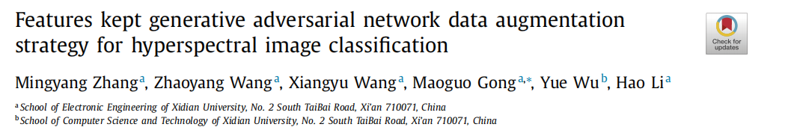
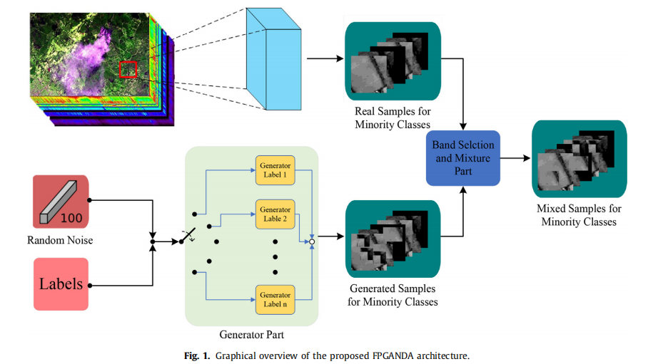
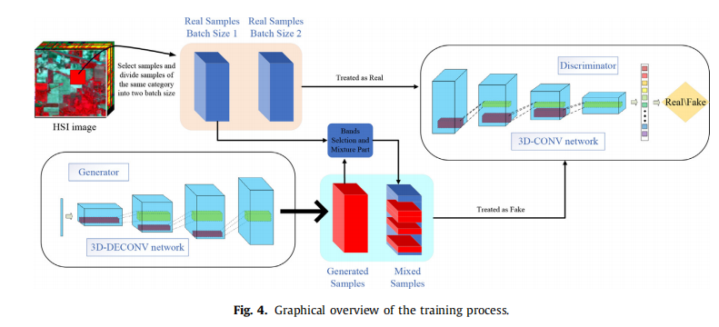
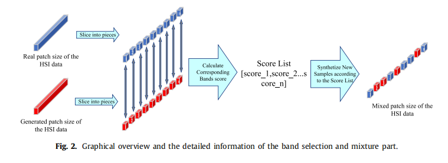

# FPGANDA Official Code Description

This is the official source code of the paper 'Features kept generative adversarial network data augmentation strategy for hyperspectral image classification'

The code first trains the GAN model, then generates new data and incorporates it into the classification network for training.

Paper link: [https://www.sciencedirect.com/science/article/abs/pii/S0031320323003990]

## Network Architecture

---

> *In recent years, significant breakthroughs have been achieved in hyperspectral image (HSI) processing us
ing deep learning techniques, including classification, object detection, and anomaly detection. However, 
the practical application of deep learning in HSI processing is limited by challenges such as small-sample 
size and sample imbalance issues. To mitigate these limitations, we propose a novel data augmentation 
strategy called Feature-Preserving Generative Adversarial Network Data Augmentation (FPGANDA). What 
sets our data augmentation strategy apart from existing generative model-based approaches is that we 
preserve the main spectral bands of HSI data using a newly designed band selection method. Addition
ally, our proposed generative model generates synthetic spectral bands, which are combined with the real 
spectral bands using a mixture strategy to create augmented data. This approach ensures that the aug
mented data retain the main features of the original data while also incorporating diverse features from 
the generated data. We evaluate our method on three different HSI datasets, comparing it with state-of
the-art techniques. Experimental results demonstrate that our proposed method significantly improves 
classification performance in most scenes and exhibits remarkable compatibility.* 
---



## Installation
A standard torch environment is required, and you can follow the DeepHyperX configuration.

Reference link: [https://github.com/nshaud/DeepHyperX]

## Instructions
### Train GAN
After configuring the dataset path information, run the following code:

```
python keepGAN.py
```

### Perform Band Selection Based on Generated Results
After training the GAN and generating samples, perform band selection.

```
python Band_Select.py
```

### Train Classifier Based on Augmented Data
Based on the selected bands, merge and generate new augmented data to train the network. For detailed parameter configurations, refer to the Completed_Band_Select.py file.

```
python Completed_Band_Select.py
```


## Notes
This project is mainly developed based on open-source codes such as WGAN, WGAN-GP, CGAN, etc. The baseline and classification networks are based on the large-scale public DeepHyperX code. The dataset reading method is also the same as in DeepHyperX.

