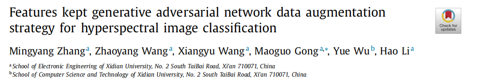
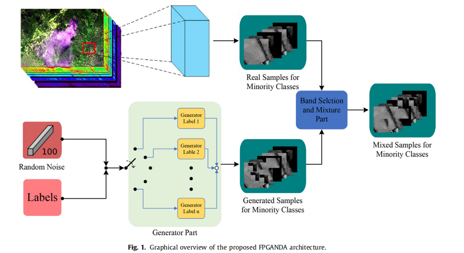
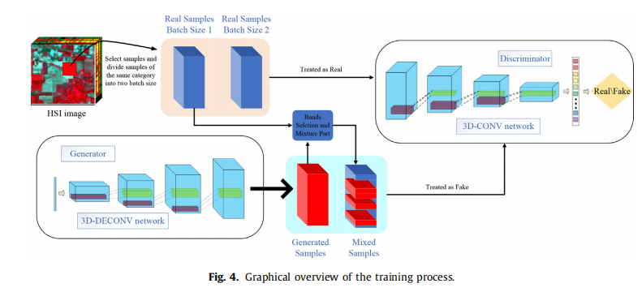
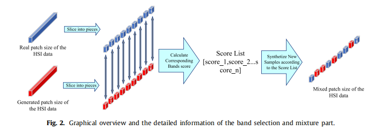

# FPGANDA: Official Code Release  
  
This repository contains the **official implementation** of the paper:  
**"Feature-Preserving Generative Adversarial Network Data Augmentation Strategy for Hyperspectral Image Classification"**

📄 **Paper Link**: [View on ScienceDirect](https://www.sciencedirect.com/science/article/abs/pii/S0031320323003990)

---

## 🧠 Overview

In recent years, deep learning has led to significant progress in **hyperspectral image (HSI)** tasks, including classification, object detection, and anomaly detection. However, these models often suffer from **limited labeled samples** and **data imbalance**.  

To address these challenges, we propose a novel **data augmentation strategy** called:

> **FPGANDA – Feature-Preserving Generative Adversarial Network Data Augmentation**

FPGANDA differs from existing GAN-based methods by **preserving key spectral features** of real HSI data using a dedicated band selection method. These preserved bands are then **fused with GAN-generated spectral features** to create more diverse and informative synthetic data, improving classification performance and robustness.

---

## 🔧 Network Architecture

### Stage 1: GAN Training  


### Stage 2: Band Selection & Data Fusion  


### Band Selection Visualization  


---

## 🎯 Key Highlights

- ✅ **Feature Preservation**: Maintains critical spectral bands using a novel band selection algorithm.
- ✅ **Synthetic + Real Fusion**: Combines generated and real bands to enhance diversity while retaining core information.
- ✅ **Improved Classification**: Outperforms state-of-the-art methods on multiple HSI datasets.
- ✅ **Modular Pipeline**: Three-step workflow for GAN training, band selection, and final classification.

---

## ⚙️ Installation

A standard **PyTorch** environment is required.

> ✅ We recommend configuring the environment based on [DeepHyperX](https://github.com/nshaud/DeepHyperX), which serves as the baseline for classification and dataset loading in this project.

---

## 🚀 How to Use

### Step 1️⃣: Train the GAN

After setting the dataset paths in the config, run:

```bash
python keepGAN.py
```

---

### Step 2️⃣: Perform Band Selection

Once GAN training and sample generation are complete, select important bands:

```bash
python Band_Select.py
```

---

### Step 3️⃣: Train the Classifier with Augmented Data

Merge selected real and generated bands to form augmented data, then train the classifier. Detailed configs can be found in `Completed_Band_Select.py`.

```bash
python Completed_Band_Select.py
```

---

## 📂 Notes

- This project builds on open-source GAN variants such as **WGAN**, **WGAN-GP**, and **CGAN**.
- Classification and data loading methods are adapted from the **DeepHyperX** framework.
- You may reuse or extend this code for other HSI tasks by modifying the band selection logic or classifier modules.

---

## 📬 Citation

> If you find this work useful in your research, please consider citing the paper (citation info will be provided upon acceptance).

---

